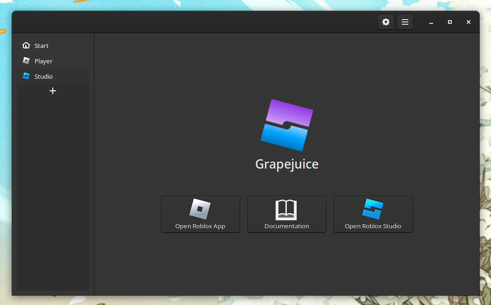
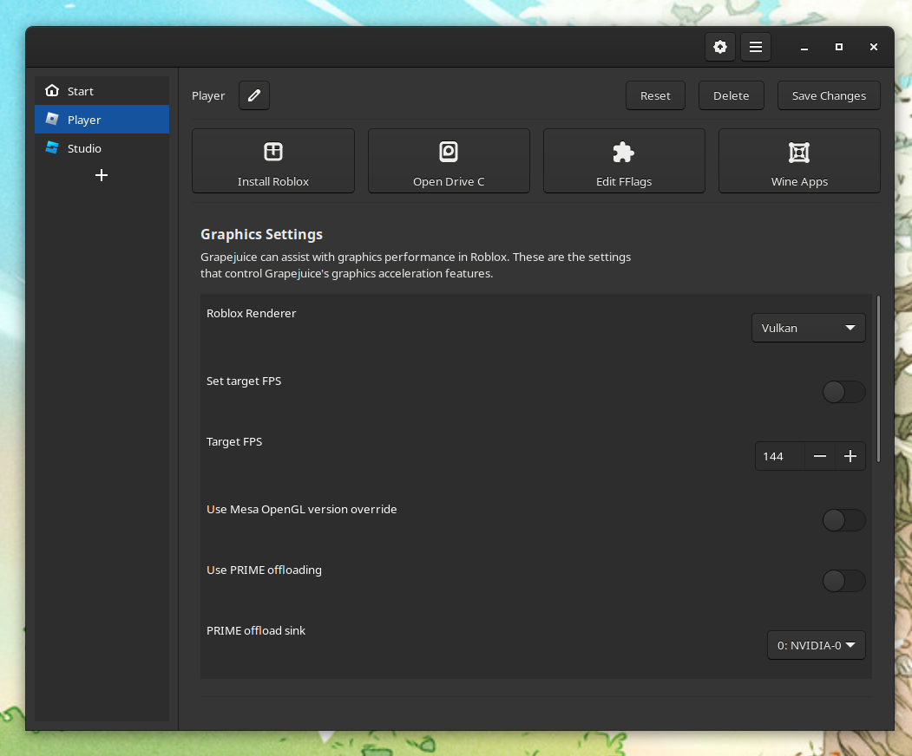
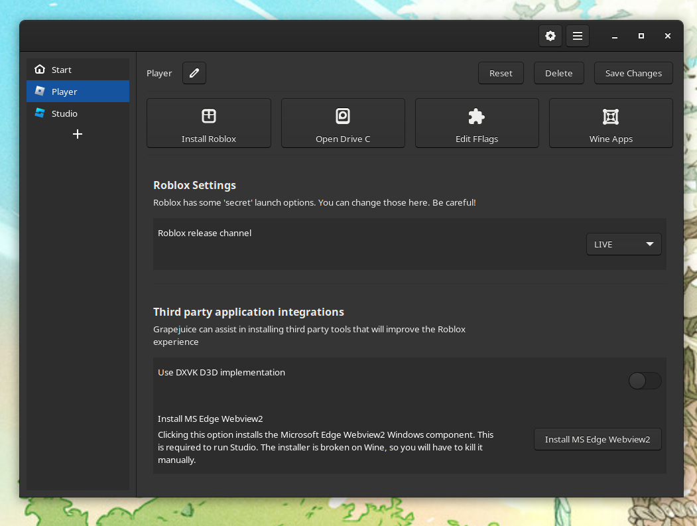
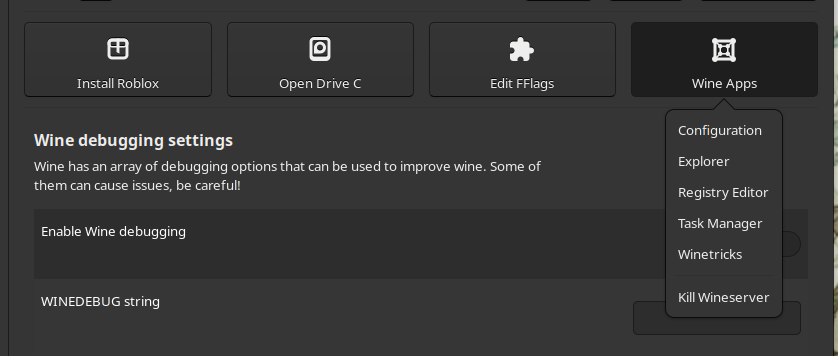

# Grapejuice

Roblox works quite well with Wine, though there are some minor issues running it. Grapejuice fills in the
gaps around these issues, so you can experience Roblox to its fullest on your favourite Linux distribution.

The primary gap-filler feature is the fact that Wine by default creates no protocol handlers, which is how Roblox
functions at its core. Without protocol handling, you won't be able to launch Roblox Studio and Experiences from the
website!

Note that Grapejuice is unofficial software. This is not officially supported by Roblox.

---

## Roblox Status

### Player

💚 The anti cheat solution in Roblox now knows how to work in Wine. So the player now works without any issues.

### Studio

🟡 Roblox Studio only seems to be broken for some people. It crashing seems to depend on the system configuration of the
user. A WineHQ Bugzilla entry has been filed: https://bugs.winehq.org/show_bug.cgi?id=54869

If you get an error launching studio, you can most likely just close it and studio will still launch. Due to Studio
being flakey, the FFlag editor might not open.

### Microsoft Edge Webiew

🟡 Roblox depends on the Microsoft Edge Webview2. The installer for this Windows component does not always close
correctly. For now, Grapejuice will block the installation of this component. It is still required for Studio, so there
is a button to install it in the Grapejuice Gui. You will have to kill the installer yourself when you think its done.

---

## Installing Grapejuice

The installation guides can be found in the [documentation](https://brinkervii.gitlab.io/grapejuice/docs/). Please read
it thoroughly!

## Troubleshooting

Are you experiencing some trouble running Roblox Studio with Grapejuice? Please check out
the [troubleshooting guide](https://brinkervii.gitlab.io/grapejuice/docs/Troubleshooting).

## Features

- Manages multiple wineprefixes. Keep customizations for the Player and Studio separated.
- Edit Roblox experiences from the website
- Enjoy Roblox experiences by launching them from the website
- FFlag editor for tweaking Roblox's behaviour
- Builtin FPS unlocker
- Automatic graphics acceleration
- Support for managing DXVK

---

## Screenshots

### Graphics settings

### Third party integrations

### Shortcuts to common actions

